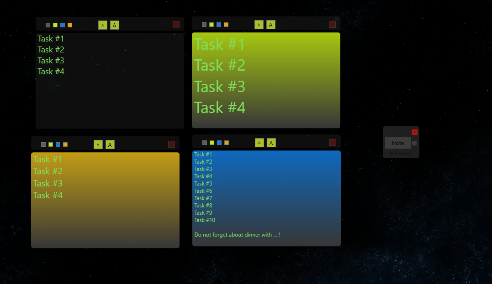

# Desk Assistant

Is sticky notes clone app for your desktop with custom features like color change, text size change in particular note.

## General Information

The app was written to test my programming skills and have some fun during cold winter nights.
At the end it serves as my daily tool at work and at home to cover my needs with writing down tasks all do some simple notes.

## Branches

* main branch consist newest release.
* release_{number} branch cover release with number {number}.
* other branches according to its description

## Technologies Used

* WPF
* .NET 6.0
* C#
* xml

## Features

* Creating notes on your desktop.
* Adding color to particular notes.
* Managing with size of text in particular note.

## Screenshot

## Prerequisities

To build project you need to install :
* visual Studio 2019 or higher.

## Creator

Created by Lukas Zlocki  
